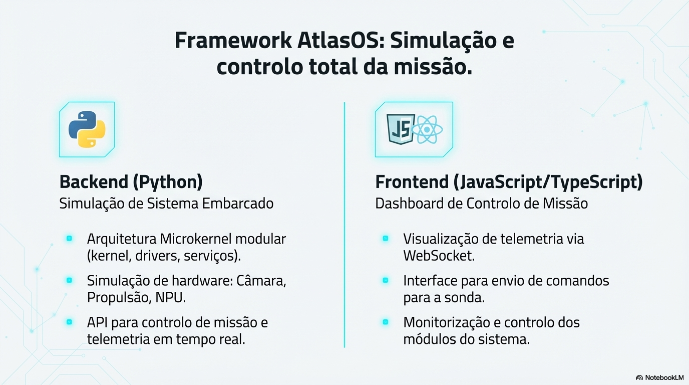

# AtlasOS - Microkernel para Exploração do Cometa 3I/ATLAS

**Projeto acadêmico completo**: Sistema operacional microkernel para sonda espacial autônoma + Dashboard de visualização em tempo real.

---

## 🌌 Sobre a Missão

Exploração científica do **3I/ATLAS**, terceiro objeto interestelar confirmado de fora do Sistema Solar, utilizando um sistema operacional microkernel de alta confiabilidade.

---

## 🖼️ Diagrama da Arquitetura



> **Diagrama completo**: Visualização das 5 camadas do microkernel, fluxo IPC hub-and-spoke, drivers isolados e Recovery Agent.

📄 **Apresentação completa**: [AtlasOS - O Coração da Mineração Espacial (PDF)](backend/Slides/AtlasOS_O_Coração_da_Mineração_Espacial.pdf)

---

## 🚀 Quick Start

### Pré-requisitos

- **Node.js 18+** (recomendado: 20+)
- **Yarn** (package manager)
- **Python 3.10+** (simulador microkernel)

### 1. Instalar dependências

```bash
# Frontend
yarn install

# Backend Node.js (API + WebSocket)
cd server
yarn install

# Backend Python (opcional - simulador)
cd backend
python3 -m pip install -r requirements.txt  # se houver
```

### 2. Executar o sistema completo

**Terminal 1 - Backend (API + WebSocket):**

```bash
cd /Users/snows/atlas-kernel-vision/server
yarn dev
```

**Terminal 2 - Frontend (Dashboard):**

```bash
cd /Users/snows/atlas-kernel-vision
yarn dev
```

### 3. Acessar o dashboard

- **Frontend:** http://localhost:5173
- **Backend API:** http://localhost:3001
- **WebSocket:** ws://localhost:3001

---

## 🏗️ Arquitetura do Sistema

```
┌─────────────────────────────────────────────────┐
│           FRONTEND (React Dashboard)            │
│  • Visualização em tempo real                   │
│  • Gráficos de CPU, IPC, Timeline               │
│  • Captura de imagens do cometa                 │
│  • Logs de eventos e alertas                    │
├─────────────────────────────────────────────────┤
│              WebSocket (ws://3001)              │
├─────────────────────────────────────────────────┤
│         BACKEND (Node.js + Express)             │
│  • Scheduler (escalonamento preemptivo)         │
│  • IPC Hub (comunicação inter-processos)        │
│  • Recovery Agent (auto-recuperação)            │
│  • Hardware Simulator (câmera, NPU)             │
└─────────────────────────────────────────────────┘
```

### Camadas do Microkernel

| Camada | Descrição              | Componentes                                    |
| ------ | ---------------------- | ---------------------------------------------- |
| **4**  | Aplicações Científicas | Análise Composição 3I/ATLAS                    |
| **3**  | Serviços de Missão     | Controle de Voo, Navegação IA, Comunicação DSN |
| **2**  | Serviços Essenciais    | Drivers (Câmera, NPU), Recovery Agent          |
| **1**  | Microkernel            | Escalonador, IPC, MMU, IRQ                     |
| **0**  | Hardware               | CPU, NPU, Câmera, Propulsores                  |

---

## 📊 Stack Tecnológica

### Frontend

| Tecnologia          | Uso                           |
| ------------------- | ----------------------------- |
| **React 18+**       | Framework UI                  |
| **TypeScript**      | Type safety                   |
| **Vite**            | Build tool (fast HMR)         |
| **Tailwind CSS**    | Estilização utilitária        |
| **shadcn/ui**       | Componentes UI                |
| **Recharts**        | Gráficos (CPU, IPC, Timeline) |
| **Framer Motion**   | Animações                     |
| **Lucide React**    | Ícones                        |
| **Zustand**         | Gerenciamento de estado       |
| **React Hot Toast** | Notificações                  |

### Backend

| Tecnologia         | Uso                    |
| ------------------ | ---------------------- |
| **Node.js 18+**    | Runtime JavaScript     |
| **Express.js**     | Framework HTTP         |
| **WebSocket (ws)** | Comunicação tempo real |
| **TypeScript**     | Type safety            |

---

## 📸 Funcionalidades

### Dashboard Principal

- ✅ **Tabela de processos** com status em tempo real
- ✅ **Gráficos de CPU** por processo
- ✅ **Monitor IPC** (mensagens inter-processos)
- ✅ **Event Log** (logs do sistema)
- ✅ **Alertas** de falhas e recuperações

### Captura de Imagens do Cometa

- ✅ **5 imagens reais** do cometa 3I/ATLAS
- ✅ **Captura automática** a cada 1 minuto
- ✅ **Ciclo contínuo** pelas imagens:
  - Núcleo Ativo
  - Coma Expansiva
  - Jato de Gás
  - Espectro Infravermelho
  - Núcleo e Coma Interstelar

### Simulação de Falhas

- ✅ **Simular crash** de processos
- ✅ **Recovery Agent** reinicia automaticamente
- ✅ **Logs de recuperação** em tempo real

---

## 📁 Estrutura de Pastas

```
atlas-kernel-vision/
├── public/
│   └── imagens/              # 5 imagens do cometa 3I/ATLAS
├── src/
│   ├── components/           # Componentes React
│   │   ├── Dashboard/        # Componentes do dashboard
│   │   └── ui/               # Componentes shadcn/ui
│   ├── pages/                # Páginas (Index, NotFound)
│   ├── store/                # Zustand store
│   ├── hooks/                # Custom hooks
│   └── types/                # TypeScript types
├── server/
│   └── src/
│       ├── index.js          # Servidor Express + WebSocket
│       └── microkernel/      # Simulador do microkernel
│           ├── Scheduler.ts
│           ├── IPC.ts
│           ├── RecoveryAgent.ts
│           └── Hardware.ts
└── package.json
```

---

## 🔗 Integração com TrabalhoOS

Este projeto é o **frontend/dashboard** do sistema AtlasOS. O backend Python está em:

```
/Users/snows/TrabalhoOS/
├── kernel/          # IPC, MMU, IRQ, Scheduler (Python)
├── drivers/         # Camera, NPU, Propulsion
├── services/        # Energy, FileSystem, Recovery
└── tests/           # Testes unitários (unittest)
```

---

## 📚 Documentação Completa

Consulte `/Users/snows/TrabalhoOS/FrameWork.md` para a documentação técnica detalhada da arquitetura microkernel.

---

## 📝 Licença

**Projeto Acadêmico** - Uso educacional livre.

---

## 👨‍🚀 Missão

**AtlasOS** — Sistema Operacional Microkernel  
Missão: Exploração do Cometa Interestelar **3I/ATLAS** ☄️

---

**🌌 "Mining the future of energy."**
