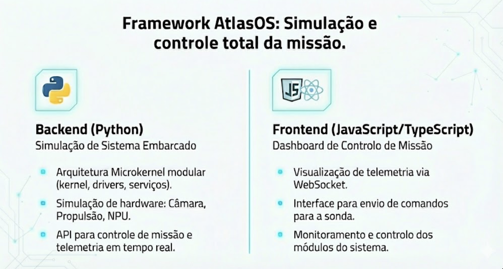
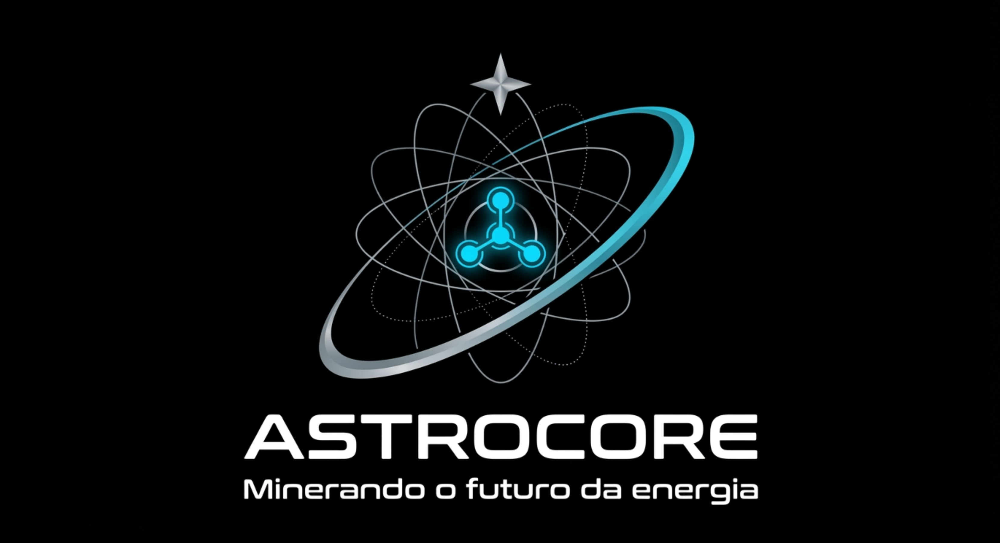
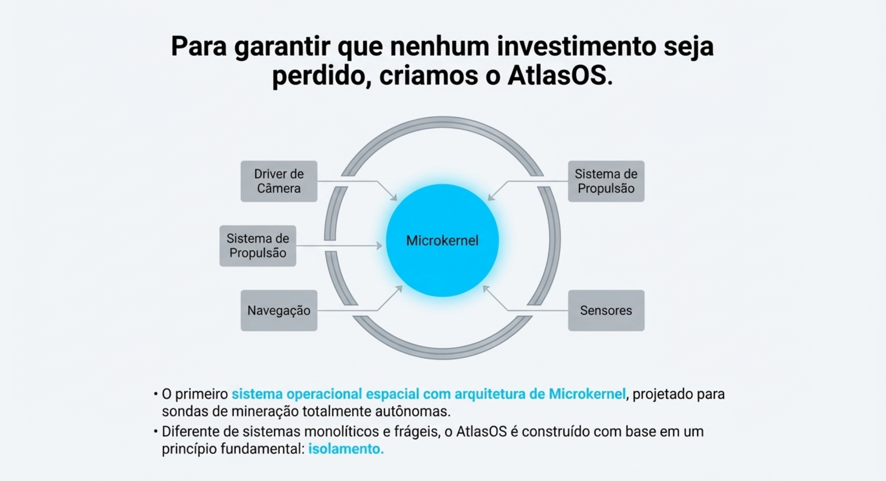

# AtlasOS - Microkernel para Exploração do Cometa 3I/ATLAS

**Projeto acadêmico**: Sistema operacional microkernel para sonda espacial autônoma em missão de exploração do cometa interestelar **3I/ATLAS**.

---

## ▶️ Quick Start

### Pré-requisitos

- **Python 3.10+** (backend microkernel)
- **Node.js 18+** (dashboard + API)
- **Yarn** (package manager)

### Executar o Sistema Completo

**Terminal 1 - Simulador Python (opcional):**

```bash
python3 main.py
```

**Terminal 2 - Backend Node.js (API + WebSocket):**

```bash
cd server
yarn install
yarn dev
```

**Terminal 3 - Frontend React (Dashboard):**

```bash
yarn install
yarn dev
```

### Acessar

| Serviço       | URL                              | Descrição           |
| ------------- | -------------------------------- | ------------------- |
| **Dashboard** | http://localhost:5173            | Interface visual    |
| **API REST**  | http://localhost:3001/api/status | Status do kernel    |
| **WebSocket** | ws://localhost:3001              | Dados em tempo real |

## 🌌 Sobre a Missão

O cometa **3I/ATLAS** é um **objeto interestelar** (terceiro visitante confirmado de fora do Sistema Solar) descoberto em 2024. Esta missão simula um sistema operacional de tempo real para uma sonda que deve:

- 📸 **Capturar imagens** do núcleo e coma do cometa
- 🔬 **Analisar composição química** (H₂O, CH₄, NH₃, compostos orgânicos)
- 🧭 **Navegar autonomamente** pela trajetória hiperbólica do cometa
- 📡 **Comunicar-se com a Terra** via Deep Space Network (DSN)

---

## 🧪 Como executar testes

Durante desenvolvimento adicionamos uma pequena suíte de testes unitários/integrados em `TrabalhoOS/tests/` usando o Python `unittest` (embora exista um arquivo antigo que usava `pytest`).

- Rodar todos os novos testes (recomendado):

```bash
python3 -m unittest discover -v tests
```

- Rodar testes específicos (ex.):

```bash
python3 -m unittest tests.test_filesystem -v
```

Observação: `pytest` é opcional — a suíte principal foi migrada para `unittest` para facilitar execução em ambientes limpos. Se preferir usar `pytest`, instale-o em seu ambiente virtual:

```bash
python3 -m pip install pytest
pytest -q
```

---

## ✅ Estado Atual (Resumo)

| Componente          | Status          | Descrição                            |
| ------------------- | --------------- | ------------------------------------ |
| **IPC Hub**         | ✅ Implementado | Comunicação hub-and-spoke síncrona   |
| **FileSystem**      | ✅ Implementado | Persistência em `data/metadata.json` |
| **MMU**             | ✅ Implementado | Alocações e proteção de memória      |
| **IRQ Handler**     | ✅ Implementado | Interrupções → IPC                   |
| **Scheduler**       | ✅ Implementado | Preemptivo (P1→P4)                   |
| **Recovery Agent**  | ✅ Implementado | Monitor + restart automático         |
| **Drivers**         | ✅ Implementado | Câmera, NPU, Propulsão               |
| **Testes**          | ✅ Implementado | `unittest` em `tests/`               |
| **Dashboard**       | ✅ Implementado | React + WebSocket tempo real         |
| **Captura Imagens** | ✅ Implementado | 5 imagens do cometa (1min intervalo) |

Para detalhes completos, veja `FRAMEWORK_CHANGE_LIST.md`.

### 🛡️ Auto-Recuperação

- Recovery Agent monitora heartbeats
- Reinício automático de processos
- Zero downtime durante falhas

---

## 🏗️ Arquitetura Microkernel

O AtlasOS implementa uma arquitetura microkernel em **5 camadas**:

```
┌─────────────────────────────────────────────────┐
│ CAMADA 4: APLICAÇÕES CIENTÍFICAS (Modo Usuário) │
│  • Análise de Composição 3I/ATLAS (P4)         │
│  • Estudos Coma/Núcleo (P4)                     │
├─────────────────────────────────────────────────┤
│ CAMADA 3: SERVIÇOS DE MISSÃO (Modo Usuário)    │
│  • Controle de Voo (P1: Crítica)                │
│  • Navegação IA (P2: Alta - NPU)                │
│  • Comunicação DSN                              │
│  • Gerência Energia                             │
├─────────────────────────────────────────────────┤
│ CAMADA 2: SERVIÇOS ESSENCIAIS (Modo Usuário)   │
│  • Driver Câmera (P3: isolado)                  │
│  • Driver NPU (P3: isolado)                     │
│  • Gerência Memória                             │
│  • Gerência Arquivos (Flash)                    │
│  • Recovery Agent (Auto-cura)                   │
├─────────────────────────────────────────────────┤
│ CAMADA 1: MICROKERNEL (Modo Kernel)            │
│  • Escalonador Preemptivo (P1>P2>P3>P4)         │
│  • IPC (Hub-and-Spoke)                          │
│  • MMU (Proteção/Isolamento)                    │
│  • Tratamento IRQ                               │
├─────────────────────────────────────────────────┤
│ CAMADA 0: HARDWARE                              │
│  • CPU (Resistente a Radiação)                  │
│  • NPU (Processamento IA)                       │
│  • Câmera (Núcleo + Coma 3I/ATLAS)              │
│  • Propulsores | Flash | Timer/Watchdog         │
└─────────────────────────────────────────────────┘
```

---

## 📂 Estrutura de Arquivos

```
backend/                           # Backend Microkernel (Python)
├── main.py                        🚀 Boot modular
├── atlasos_sim.py                 🎮 Simulador interativo
├── kernel/
│   ├── ipc.py                     📨 IPC Hub-and-Spoke
│   ├── scheduler.py               ⚡ Escalonador preemptivo
│   ├── mmu.py                     🛡️ Gerenciamento de memória
│   └── irq.py                     🔔 Handler de interrupções
├── drivers/
│   ├── camera.py                  📸 Driver de câmera
│   ├── npu.py                     🧠 Driver NPU (IA)
│   └── propulsion.py              🚀 Driver de propulsão
├── services/
│   ├── recovery.py                🔄 Recovery Agent
│   ├── filesystem.py              💾 Sistema de arquivos
│   ├── energy.py                  ⚡ Gerência de energia
│   ├── navigation.py              🧭 Navegação IA
│   └── flight_control.py          ✈️ Controle de voo
├── tests/                         🧪 Testes unitários (unittest)
├── data/metadata.json             📊 Persistência
├── FrameWork.md                   📚 Documentação técnica
└── AtlasOS_Microkernel.drawio     🎨 Diagrama visual

src/                               # Frontend Dashboard (React)
├── components/Dashboard/          🖥️ Componentes do dashboard
├── pages/Index.tsx                📄 Página principal
└── store/                         🗃️ Estado global (Zustand)

server/                            # API + WebSocket
└── src/index.js                   🔌 Servidor Node.js

public/imagens/                    📸 5 imagens do cometa
```

---

## 🎯 Conceitos Demonstrados

### ✅ **1. Escalonamento por Prioridade**

- **P1 (Crítica):** Controle de Voo - Tempo Real
- **P2 (Alta):** Navegação IA - Processamento NPU
- **P3 (Média):** Drivers isolados
- **P4 (Baixa):** Aplicações científicas

### ✅ **2. IPC (Inter-Process Communication)**

- **Hub-and-Spoke:** Todos os processos comunicam-se via IPC central
- **Mensagens assíncronas:** Não há comunicação direta entre processos
- **Segurança:** Kernel controla todas as trocas de mensagens

### ✅ **3. Isolamento de Falhas**

- **Drivers em Modo Usuário:** Falhas não derrubam o kernel
- **MMU:** Proteção de memória entre processos
- **Recovery Agent:** Detecta e reinicia processos travados

### ✅ **4. Auto-Recuperação (Self-Healing)**

- **Watchdog Timer:** Monitora processos críticos
- **Reinício Automático:** Recovery Agent reinicia drivers sem intervenção
- **Zero Downtime:** Sistema continua operacional durante falhas

---

## 📊 Diagrama Visual

Abra o arquivo `AtlasOS_Microkernel.drawio` no [draw.io](https://app.diagrams.net) para visualizar:

- ✅ Todas as 5 camadas do sistema
- ✅ 28 conexões IPC (Hub-and-Spoke)
- ✅ Fluxo de interrupção (Câmera → Kernel → IPC → Driver → Flash)
- ✅ Recovery Agent → Drivers (auto-cura)
- ✅ Legenda completa de prioridades e comunicação

---

## 🔬 Exemplo: Cenário de Missão

**Um dia típico na exploração do 3I/ATLAS:**

```
🕐 00:00 - Sonda aproxima-se do cometa (150.000 km)
🕑 02:00 - Navegação IA detecta jato de gás ativo na coma
🕕 06:00 - Câmera captura imagem do núcleo (resolução 10m/pixel)
🕗 08:00 - App "Analisar Composição" processa imagem via NPU
🕙 10:00 - 💥 FALHA! Driver NPU trava (radiação cósmica)
         → Recovery Agent detecta timeout
         → Reinicia Driver NPU automaticamente
         → Sistema continua operacional
🕛 12:00 - Comunicação DSN com Terra (janela de 2 horas)
🕐 14:00 - Gerência Energia avalia recursos
🕓 16:00 - Navegação IA calcula nova manobra
🕘 00:00 - Missão entra em modo "Deep Sleep"
```

---

## 📊 Stack Tecnológica Completa

### Backend (Microkernel)

| Tecnologia         | Uso                    |
| ------------------ | ---------------------- |
| **Python 3.10+**   | Linguagem principal    |
| **unittest**       | Framework de testes    |
| **Node.js 18+**    | API + WebSocket server |
| **Express.js**     | Framework HTTP         |
| **WebSocket (ws)** | Comunicação tempo real |

### Frontend (Dashboard)

| Tecnologia        | Uso            |
| ----------------- | -------------- |
| **React 18+**     | Framework UI   |
| **TypeScript**    | Type safety    |
| **Vite**          | Build tool     |
| **Tailwind CSS**  | Estilização    |
| **shadcn/ui**     | Componentes UI |
| **Recharts**      | Gráficos       |
| **Framer Motion** | Animações      |
| **Zustand**       | Estado global  |

---

## 📖 Documentação Técnica

Consulte **`FrameWork.md`** para:

- 📋 Visão geral da arquitetura
- 🌌 Características do cometa 3I/ATLAS
- 🏗️ Estrutura detalhada das 5 camadas
- 🔗 Modelo Hub-and-Spoke IPC
- 📊 Validação arquitetural
- 🚀 Fluxo de boot completo
- 📝 Exemplo: Fluxo de interrupção
- 🌟 Objetivos científicos da missão

---

## 🎓 Objetivo Acadêmico

Demonstrar os princípios de um **microkernel moderno** em sistemas embarcados críticos:

1. **Minimalismo:** Apenas 4 componentes no kernel (Escalonador, IPC, MMU, IRQ)
2. **Isolamento:** Drivers e serviços em modo usuário
3. **Confiabilidade:** Falhas localizadas não derrubam o sistema
4. **Preemptividade:** Tarefas críticas sempre executam primeiro
5. **Comunicação Segura:** IPC como único canal de comunicação

---

## 🛡️ Mitigação de Riscos

### **Priority Inversion**

- **Solução:** Priority Inheritance Protocol
- Processos de baixa prioridade herdam temporariamente a prioridade de bloqueados

### **Radiação Cósmica**

- **CPU Resistente:** Triple Modular Redundancy (TMR)
- **Recovery Agent:** Reinício automático de processos corrompidos
- **Watchdog Timer:** Detecta travamentos (timeout 3 segundos)

### **Comunicação Limitada com Terra**

- **Autonomia:** Decisões tomadas localmente via IA (NPU)
- **Janelas DSN:** 2 horas a cada 12 horas
- **Prioridade P1:** Controle de voo sem dependência de comandos terrestres

---

## 📚 Referências

- Tanenbaum, A. S. (2015). _Modern Operating Systems_ (4th ed.)
- MINIX 3: Microkernel Design and Implementation
- NASA Deep Space Network (DSN) Protocol Specification
- ESA Rosetta Mission: Comet 67P/Churyumov-Gerasimenko
- 3I/ATLAS: _Nature Astronomy_ (2024) - Interstellar Comet Discovery

---

## 📝 Licença

**Projeto Acadêmico** - Uso educacional livre.

---

## 👨‍🚀 Autor

**Sistema Operacional AtlasOS**  
Projeto de Sistemas Operacionais - Arquitetura Microkernel  
Missão: Exploração do Cometa Interestelar 3I/ATLAS ☄️

---

## 🖼️ Diagrama da Arquitetura



> **Diagrama completo**: Visualização das 5 camadas do microkernel, fluxo IPC hub-and-spoke, drivers isolados e Recovery Agent.

---

## 📽️ Slides da Apresentação

| Slide       | Visualização                  |
| ----------- | ----------------------------- |
| **Slide 1** |  |
| **Slide 2** |  |
| **Slide 3** |  |
| **Slide 4** |  |
| **Slide 5** |  |
| **Slide 6** |  |
| **Slide 7** |  |
| **Slide 8** |  |
| **Slide 9** |  |

---

**🌌 "Sem possibilidade de reinício manual a milhões de km da Terra!"**
